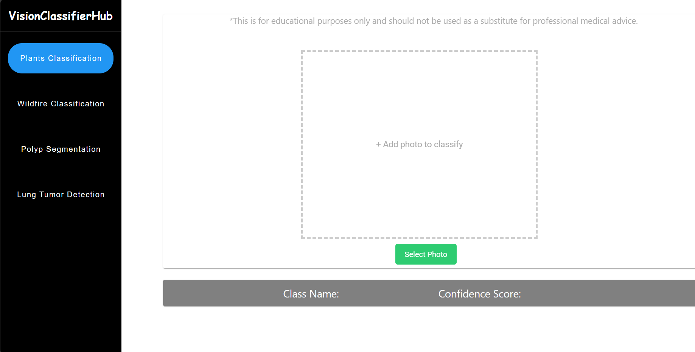

# VisionClassifierHub

## Overview
This repository hosts the code implementation of  hybrid models designed to classify Bangladeshi Medicinal Plants, Wildfire Classification, Polyp Segmentation and lung tumor detection. 

## Implementation
* **Frontend:** Vue.js - A progressive JavaScript framework for building interactive user interfaces. The frontend provides a seamless and intuitive user experience for interacting with the model.
* **Backend:**  FastAPI - A modern, fast (high-performance) web framework for building APIs with Python 3.12.0. FastAPI enables efficient communication between the frontend and the model serving backend.

## Images 

