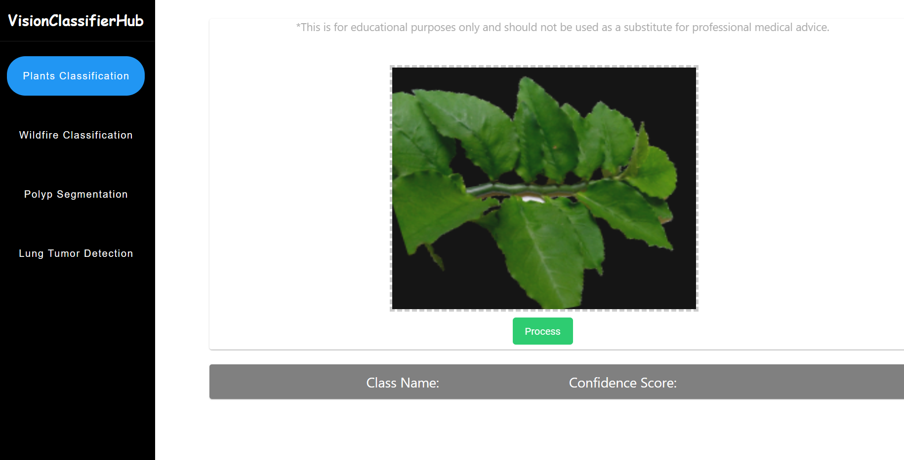
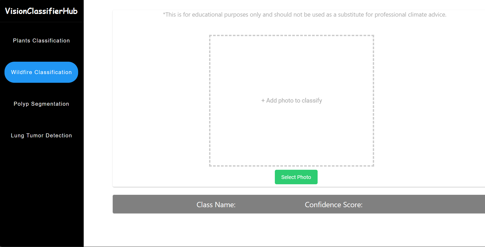

# OVERVIEW
In this repository, you'll discover a variety of hybrid models inspired by my research paper. These models are designed to tackle various computer vision tasks, ranging from identifying Bangladeshi Medicinal Plants to spotting Wildfires, finding Polyps in medical images, and detecting Lung Tumors.

Each model represents a culmination of rigorous work and testing. They're not just theoretical concepts, they're practical solutions to real-world problems. I've invested significant time and effort into ensuring that these models are not only effective but also reliable for real-world applications.

If you're passionate about computer vision and solving practical challenges, you'll likely find these models interesting and valuable. Dive in and explore the possibilities!

# IMPLEMENTATION
* **Frontend:** Vue.js - A progressive JavaScript framework for building interactive user interfaces. The frontend provides a seamless and intuitive user experience for interacting with the model.
  
* **Backend:**  FastAPI - A modern, fast (high-performance) web framework for building APIs with Python 3.12.0. FastAPI enables efficient communication between the frontend and the model serving backend.

# DESIGN IMAGES 
## IMAGE 1

## IMAGE 2

## IMAGE 3 

## IMAGE 4 

# REFERENCE PAPER
* [Wild Fire Classification](https://www.mdpi.com/1999-4907/14/10/2080/pdf?version=1697593987)
* [Bangladeshi Medicinal Plants Classification](https://ieeexplore.ieee.org/abstract/document/10441138)

